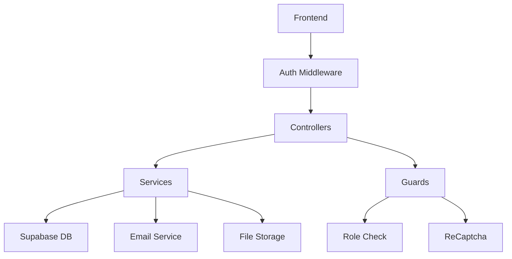

# NestJS Modules

> **TL;DR** — A NestJS module is a single cohesive unit of code _annotated with `@Module()`_ that bundles together **providers**, **controllers**, and **other imported modules**. Everything in a Nest application lives inside one or more modules; they are the primary building‑block for structure, encapsulation, and reuse.

---

# Backend Modules

## Core Business Modules

### Authentication (`auth/`)

- **JWT-based authentication with Supabase**
- Endpoints: `/auth/*`
- Features: Login, logout, token refresh

### Booking Management (`booking/` + `booking_items/`)

- **Complete booking lifecycle**
- Endpoints: `/bookings/*`, `/booking-items/*`
- Features: Create, confirm, reject, cancel, update bookings
- Email notifications for all state changes

### Storage Items (`storage-items/`)

- **Inventory management with availability checking**
- Endpoints: `/items/*`
- Key Features:
  - Availability calculation for date ranges
  - Excel bulk import
  - Category and tag management
  - Image upload integration

### Organization Management (`organization/`)

- **Multi-tenant organization system**
- Endpoints: `/organizations/*`
- Features: Org CRUD, member management, role assignments

### User Management (`user/` + `role/` + `user-banning/`)

- **User profiles, roles, and moderation**
- Endpoints: `/users/*`, `/roles/*`
- Features: Profile management, role-based access, user banning

## Support Modules

### Email System (`mail/`)

- **React Email templates with SMTP**
- 10+ email templates for booking lifecycle
- Preview endpoints for development

### File Upload (`item-images/`)

- **Image upload with validation and compression**
- Supabase Storage integration
- Automatic thumbnail generation

### Categorization (`categories/` + `tag/`)

- **Flexible item categorization**
- Hierarchical categories with translations
- Tag system for flexible labeling

### Location Management (`storage-locations/` + `organization-locations/`)

- **Physical location hierarchy**
- Multi-level location structure

### Logging & Monitoring (`logs_module/` + `reminders/`)

- **Structured logging and audit trails**
- Automated reminder system

## Security Layer

### Guards

- **`roles.guard.ts`** - Role-based access control
- **`recaptcha.guard.ts`** - Bot protection

### Middleware

- **`Auth.middleware.ts`** - Authentication preprocessing
- Request sanitization and validation

## 🔍 Module Dependencies



# Explanations

## 1. Why modules?

- **Encapsulation** – isolate related features so they can evolve independently.
- **Reusability** – import the same functionality into many parts of the app without duplication.
- **Testability** – build focused test‐beds around a single module.
- **Scalability** – let large teams own distinct, versionable features.

> Nest treats every file containing a `@Module()` decorator as a metadata map that tells the **IoC container** what to instantiate at runtime.

---

## 2. The anatomy of `@Module()`

```ts
import { Module } from "@nestjs/common";

@Module({
  imports: [], // other modules whose exported providers you need here
  controllers: [], // route handlers (they receive requests)
  providers: [], // service classes, guards, interceptors, pipes, etc.
  exports: [], // subset of providers that *this* module makes public
})
export class SomeModule {}
```

| Key             | Purpose                                                                              | Typical examples                          |
| --------------- | ------------------------------------------------------------------------------------ | ----------------------------------------- |
| **imports**     | Bring in providers, controllers, or other metadata **exported** by external modules. | `TypeOrmModule.forFeature([...])`         |
| **controllers** | Map HTTP/WebSocket routes to ‘verbs’ for this feature.                               | `UsersController`                         |
| **providers**   | Injectable classes created **once per module** (default singleton scope).            | Services, repositories, factories, guards |
| **exports**     | Re‑export providers so **other** importing modules can inject them.                  | Re‑export `UsersService` for Auth feature |

---

<details>
<summary><strong><span class="cy">Hint</span> — Click to expand</strong></summary>

To create a module using the **CLI**, simply execute the command.

```bash
npx nest g module AppModule
```

</details>

## 3. Root vs. feature modules

- **`AppModule`** – the first module imported by `NestFactory.create()`; it typically only re‑exports feature modules.
- **Feature modules** – encapsulate a specific domain area (e.g. `UsersModule`, `BookingsModule`).
- A **lazy‑loaded** module isn’t a separate concept in Nest (unlike Angular), but you can achieve similar behaviour with dynamic modules or separate micro‑services.

---

## 4. A real‑world feature module

```ts title="booking/booking.module.ts"
import { Module } from "@nestjs/common";
import { BookingController } from "./booking.controller";
import { BookingService } from "./booking.service";
import { InvoiceService } from "./invoice.service";
import { SupabaseModule } from "../supabase/supabase.module";
import { MailModule } from "../mail/mail.module";

@Module({
  imports: [SupabaseModule, MailModule],
  controllers: [BookingController],
  providers: [BookingService, InvoiceService],
})
export class BookingModule {}
```

### Walk‑through

| Section         | What it does in this example                                                                                                         |
| --------------- | ------------------------------------------------------------------------------------------------------------------------------------ |
| **imports**     | `SupabaseModule` exposes a database client; `MailModule` exposes mailing providers – both are now injectable into the booking stack. |
| **controllers** | `BookingController` defines REST endpoints like `POST /bookings`.                                                                    |
| **providers**   | `BookingService` holds business rules; `InvoiceService` generates/dispatches invoices.                                               |

Because nothing is exported, only **booking‐internal** classes can inject `BookingService` or `InvoiceService`. Other modules would need to expose them explicitly via `exports`.

---

<details>
<summary><strong><span class="cy">Hint</span> — Click to expand</strong></summary>

Making everything global is **not recommended** as a design practice. While global modules can help reduce boilerplate, it's generally better to use the imports array to make a module's API available to other modules in a controlled and clear way.

This approach provides better structure and maintainability, ensuring that only the necessary parts of the module are shared with others while avoiding unnecessary coupling between unrelated parts of the application.

</details>

## 5. Shared & global modules

### Shared module pattern

```ts
@Module({
  providers: [LoggerService],
  exports: [LoggerService],
})
export class LoggerModule {}
```

Any module that imports `LoggerModule` can now inject `LoggerService`.

### Global modules

Sometimes you want a provider to be available **application‑wide** without having to import the module everywhere. Decorate your module with `@Global()`:

```ts
import { Global, Module } from "@nestjs/common";

@Global()
@Module({
  providers: [ConfigService],
  exports: [ConfigService],
})
export class ConfigModule {}
```

> You must still import a global module **once** (typically in `AppModule`) so Nest can register it.

---

## 6. Dynamic modules (`forRoot()` / `forFeature()` pattern)

Dynamic modules let you pass configuration at import‑time and/or expose extra providers.

```ts
@Module({})
export class DatabaseModule {
  static forRoot(options: DBOptions): DynamicModule {
    return {
      module: DatabaseModule,
      providers: [
        {
          provide: DB_OPTIONS,
          useValue: options,
        },
        DatabaseService,
      ],
      exports: [DatabaseService],
    };
  }
}
```

Then consume it:

```ts
imports: [DatabaseModule.forRoot({ url: process.env.DB_URL })];
```

---

## 7. Testing modules

Nest supplies an in‑memory IoC container for tests:

```ts
const moduleRef = await Test.createTestingModule({
  imports: [BookingModule],
}).compile();

const service = moduleRef.get<BookingService>(BookingService);
```

You can override providers, mock dependencies, or load only a subset of a module graph.

---

## 8. Best practices & gotchas

| Do                                                       | Don’t                                            |
| -------------------------------------------------------- | ------------------------------------------------ |
| Keep each module focused on **one bounded context**      | Pollute `AppModule` with lots of providers       |
| Export **only** what needs to be consumed elsewhere      | Re‑export every provider ‘just in case’          |
| Prefer _feature‑modules_ over fat services               | Inject random services between unrelated domains |
| Make utility modules **global** when truly cross‑cutting | Rely on circular imports to break encapsulation  |

---

## 9. Further reading

- [NestJS – Modules](https://docs.nestjs.com/modules)
- [Providers & Dependency Injection](https://docs.nestjs.com/providers)
- [Testing](https://docs.nestjs.com/fundamentals/testing)

---

<style>
    h2{
        color: rgb(198, 100, 255)
    }
   .cy{
        color: rgb(45, 255, 244);
        font-size: 16px;
        font-weight: 900;
    }
    .cy:hover{
        color:rgb(147, 22, 231);
        text-decoration: underline;
    }
  
</style>
