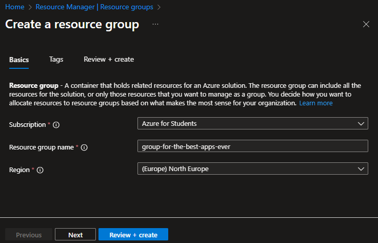
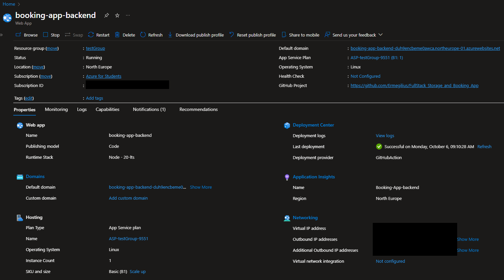
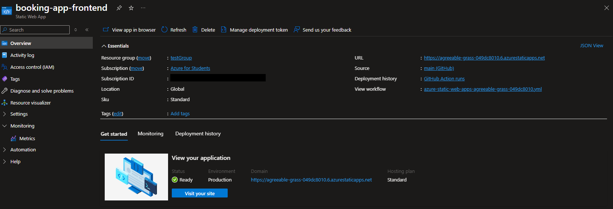

# Azure Resource Setup Guide for Harakka Application

This guide provides detailed instructions for setting up the required Azure resources for the Harakka application.

## Creating the Resource Group

1. Login to the [Azure Portal](https://portal.azure.com)
2. Navigate to "Resource groups" and click "Create"
3. Complete the form:
   - **Subscription**: Select your subscription
   - **Resource group name**: Select your resource name
   - **Region**: Select preferred region
4. Click "Review + create", then "Create"

2. Visual Step-by-Step Guides

## Creating the App Service (backend)

1. From the Azure Portal, search for "App Services" choose "Create" and "Web App"

2. Configure key values:
   - Subscription: <`your subscription`>
   - Resource Group: <`previously created resource group`>
   - Name: <`your app name`>
   - Plan type: Standard: For general purpose production apps
   - Deployment details: GitHub
     - Organization: <`your organization`>
     - Repository: <`your repository`>
     - Branch: main
   - Publishing model: Code
   - Runtime stack: Node - 20-lts
   - Operating System: Linux
   - Region: <`your region`>
   - App Service Plan: Create new
     - Name: <`your backend app name`>
     - SKU: Basic B1

Example of created app overview:

### Rest settings for App Service

1. Navigate to your App Service → Settings → Configuration
   Add the following application settings:
   - `Startup Command`: npm run start:prod
2. Navigate to your App Service → Settings → Environment variables
   Add required environment variables

## Creating Static Web App (frontend)

1. Search for "Static Web Apps" and click "Create"

2. Configure key values:

- Subscription: <`your subscription`>
  - Resource Group: <`previously created resource group`>
  - Name: <`your app name`>
  - Hosting plan: Standard: For general purpose production apps
  - Source: GitHub
  - Organization: [Your Organization]
  - Repository: [Your Repository]
  - Branch: main

Example of created app overview:

### Rest settings for App Service

1. Navigate to your App Service → Settings → Configuration
   Add the following application settings:

   - `Deployment authorization policy`: Deployment token
   - sign in as GitHub user

2. Navigate to your App Service → Settings → Environment variables
   Add required environment variables

## Setting Up GitHub Secrets

1. Go to your GitHub repository
2. Navigate to Settings → Secrets and variables → Actions
3. Click "New repository secret"
4. Add each required secret.
